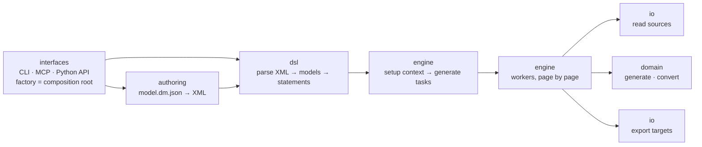
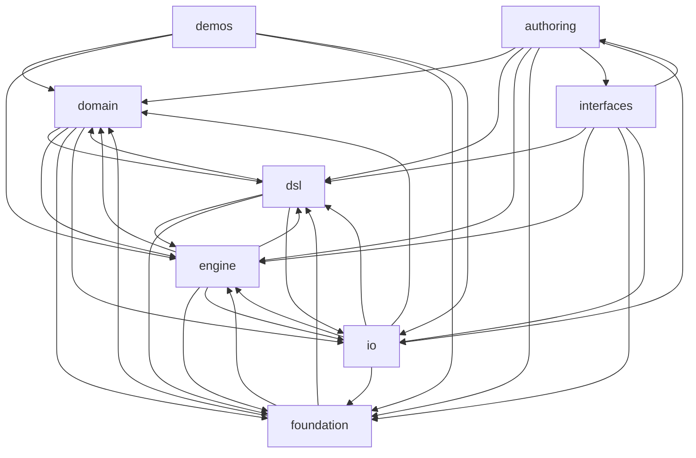

# datamimic_ce architecture

Seven product components and their allowed directions. [`architecture-contract.json`](../../architecture-contract.json)
is the SPOT; `archkeel validate` fails on any new edge between components, any import of a
non-public name across components, and any third-party library outside its declared owners.

## Lifecycle of a run

## Components

| Component | Responsibility | Must not | Packages |
|---|---|---|---|
| `interfaces` | CLI, MCP server and Python API (datamimic, data_mimic_test); factory is the composition root that wires a run | business logic; being imported by other components | `cli`, `cli_authoring`, `cli_presenter`, `cli_runtime`, `mcp`, `datamimic`, `data_mimic_test`, `factory` |
| `authoring` | model.dm.json intent to XML; lint rules and rule catalog; bounded dry-run and acceptance verification | importing interfaces | `authoring` |
| `dsl` | the DSL: XML parsing, element models, statements | execution; knowledge of contexts or connections | `model`, `parsers`, `statements`, `constants`, `enums` |
| `engine` | run lifecycle: setup, tasks, workers; script-expression evaluation | generator logic; database details | `tasks`, `workers`, `contexts`, `services`, `product_storage` |
| `io` | adapters to external systems: sources, exporters, clients, connection configuration | driving the run lifecycle | `data_sources`, `exporters`, `clients`, `connection_config` |
| `domain` | pure data generation and value conversion | workers; contexts; connections; statements | `domains`, `converter` |
| `foundation` | stable, low-semantic types and technical primitives needed by at least two components; determinism SPOTs: rng, clock, RunSeed; logger and process settings | importing any other component; knowledge of DSL, engine, domain or IO | `utils`, `logger`, `config`, `_compat` |
| `demos` | bundled examples that use the product; not part of the product architecture | being imported by product components | `demos` |

`foundation` holds only stable, low-semantic types and technical primitives that at least two
components need, and knows nothing about DSL, engine, domain or IO. This describes the target;
today's contents are not yet that pure (see Debt). `demos` uses the product and
is not part of the product architecture.

## Dependencies

Target direction: `interfaces → authoring → dsl`, `authoring → engine`, `interfaces → engine`,
`engine → dsl / domain / io`, everyone → `foundation`. The graph below is the observed state that
`archkeel validate` compares with the code; it includes the debt edges.

<!-- archkeel-component-graph -->

### Under review

- `io → dsl`: existing coupling; adapters should not need to know the DSL, the engine should translate DSL configuration for them. Level 2 decides.

### Debt

Existing edges against the target, accepted so the gate stays green; each is removed by moving
code, never by widening the contract.

| Edge | Cause and target |
|---|---|
| `authoring → interfaces` | authoring.dryrun starts a run through the DataMimic interface; target: call the engine directly. |
| `domain → dsl` | generator_util resolves generators per statement and literal generators read DSL enums; target: generator_util moves to engine, shared enums move to their owner or foundation one by one. |
| `domain → engine` | generator_util reads contexts; target: generator_util moves to engine. |
| `domain → io` | DataSourcePagination and SequenceTableGenerator's database access; target: decide per type (value type or io semantics). |
| `dsl → domain` | state_machine_statement builds a generator; target: the engine builds it. |
| `dsl → engine` | statements import contexts; target: the DSL does not know execution. |
| `dsl → io` | statements import MongoDB client and connection configs; target: the DSL does not know connections. |
| `foundation → domain` | utils.object_util references converters; target: move to engine. |
| `foundation → dsl` | utils read DSL constants and enums; target: foundation imports nothing. |
| `foundation → engine` | utils.object_util builds converters with contexts; target: move to engine. |
| `io → domain` | clients serialize with domain base_entity; target: a foundation helper. |
| `io → engine` | DataSourceRegistry evaluates source scripts with contexts; target: an engine-provided port. |

Debt cannot grow: `tests_ce/architecture/test_architecture_debt_budget.py` freezes the exact
imports on each debt edge in `architecture_debt_budget.json`. A new import over a debt edge fails,
and a removed one must be dropped from the budget, so it only shrinks.

## Cross-component surface

A component's `public` list in the contract is the **currently permitted cross-component surface,
not its intended long-term public API**: it froze the names other components used when the
contract was introduced. A new import of any other name fails. Listing a name there does not make
it a supported API or a reason not to change it; the lists shrink toward small facades.

| Component | Permitted surface today (names) | Target facade |
|---|---:|---|
| `interfaces` | 1 | to be defined, intentionally small |
| `authoring` | 18 | to be defined, intentionally small |
| `dsl` | 128 | to be defined, intentionally small |
| `engine` | 7 | to be defined, intentionally small |
| `io` | 21 | to be defined, intentionally small |
| `domain` | 39 | to be defined, intentionally small |
| `foundation` | 30 | to be defined, intentionally small |
