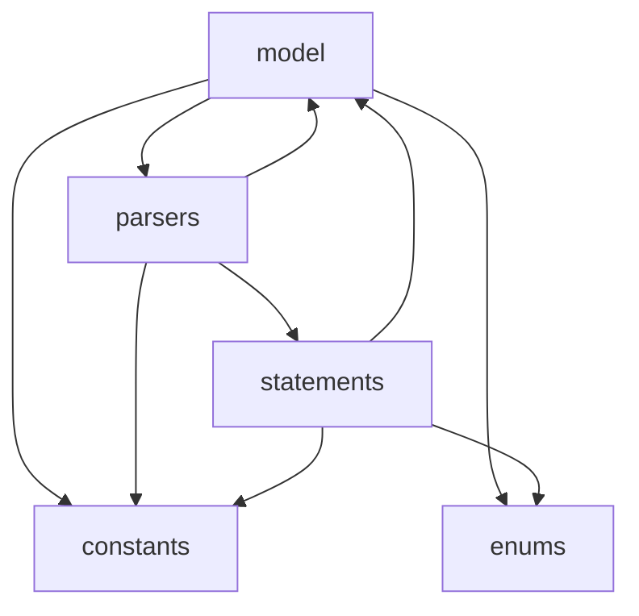

# dsl (level 2)

Inside of the `dsl` component in [architecture.md](architecture.md); [`dsl-contract.json`](dsl-contract.json) is its SPOT.

| Component | Responsibility |
|---|---|
| `model` | Pydantic element models, constraints and the element registry |
| `parsers` | XML parsing into statements |
| `statements` | runtime statement objects |
| `constants` | DSL element and attribute names |
| `enums` | DSL value vocabularies |

<!-- archkeel-component-graph -->

## Debt

Observed edges the target forbids; frozen in the debt budget, not allowed by the contract.

- `model → parsers`: models reach parser implementations, a cycle with parsers -> model; target: models own identity and child rules and never import parsers (EE DEP-MODEL-NO-PARSERS).
