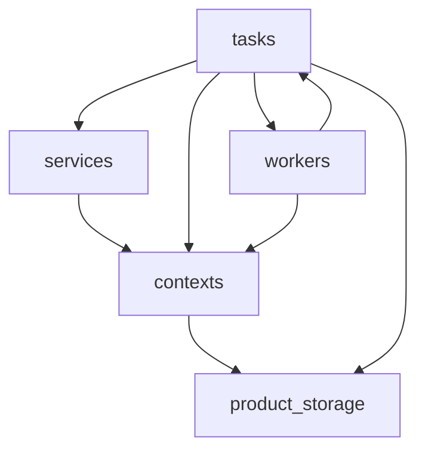

# engine (level 2)

Inside of the `engine` component in [architecture.md](architecture.md); [`engine-contract.json`](engine-contract.json) is its SPOT.

| Component | Responsibility |
|---|---|
| `tasks` | setup, generate, variable and key tasks; single-process policy |
| `workers` | page-wise generation workers (multiprocessing and Ray) |
| `contexts` | setup and generation contexts; script-expression namespace |
| `services` | source-script evaluation |
| `product_storage` | memstore and product storage |

<!-- archkeel-component-graph -->

## Debt

Observed edges the target forbids; frozen in the debt budget, not allowed by the contract.

- `workers → tasks`: workers call back into tasks, a cycle with tasks -> workers; target: workers receive what they run and never import tasks.
