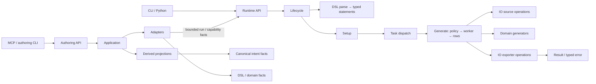

# CE / EE target architecture — recursive definition

Date: 2026-09-27. Status: **Astra-decided target; implementation not complete**.
See [Astra's semantic decisions](semantic-review/astra-target-decision.md) and
[Amendment 20](../refactoring-study/experiment-2/amendment-20.md).
Published ArchKeel 0.8.0 timed out on the earlier draft. The local candidate
completes but reports failures; neither result certifies this target.
This replaces the earlier 0.7 design notes in this file, not the experiment history.
Alex's decisions: equal physical core paths, EE leads shared semantics, stable root
`errors/`, no legacy import shims, no Rust or EE runtime configuration in CE.
Delegated grouping and interface decisions remain marked `decided_by: agent` in JSON.

The source-to-target map and recursive review are in
[structure-review.json](structure-review.json). The shared root below applies to
both `datamimic_ce` and `datamimic_ee`. See [EE migration](edition-alignment.md)
for edition-only additions and the superseded Experiment 3 proposal.
Each current CE Python file has one target sentence in the deepest mounted
contract's `declarations.modules`; those declarations are the report's target
inventory. The source review is historical evidence; its explicit target
overrides must match the contract declarations.

Every current CE Python module has a target path and a candidate responsibility
sentence: one-to-one moves inherit the historical source concern from
`semantic-review/review-*.json`; revised modules have explicit
`target_module_concerns` in the structure review. `architecture-definition-check`
checks coverage, not semantic correctness. The sentences are native ArchKeel
target declarations, but they are not yet individually accepted. The root
`__init__.py` is an inert package initializer, not an environment owner.
CLI and MCP executable startup load only the startup cwd `.env` with
`override=False` before reading settings or transport defaults. Library callers
prepare their own environment. Runtime settings resolve on use. Descriptor
`.env.properties` lookup remains separate. This deliberately changes the old
import-time bootstrap behavior ([Amendment 68](../refactoring-study/experiment-2/amendment-68.md)).
The empty `engine/__init__.py` is namespace scaffolding; neither initializer
is a catch-all component.

## Physical target

```text
<edition>/
  __init__.py                    inert package initializer
  _compat.py                     Python-version primitives only, where needed
  randomness.py                  shared RNG protocol and weighted-index primitive
  interfaces/
    cli/                        inert package, executable startup, command registration, presentation
    mcp/                        inert package, executable startup, optional typed tool transport
    python/                     DataMimic, test harness, factory entry points
      datamimic.py  data_mimic_test.py  factory.py
    demo.py  project.py
  authoring/
    api.py  contracts.py  spec/
    domain/
      diagnostics.py  schema.py  script_semantics.py
      rule_catalog.py
      acceptance.py  verification.py   verdict policy over full capture evidence
      rules/                    base, schema, semantics, intent, cross-statement
    application/                service owns compile/run/acceptance/replay sequencing
    adapters/                   XML loading/lint, bounded execution, live reference/capability views
    projection/                 typed authoring-reference variants; no runtime imports
  engine/
    dsl/
      api.py
      vocabulary/
        constants/  enums/      canonical names and closed values
        source_capabilities.py  source-format and source-mode facts
      model/
        validation.py  constraints/  flow/  values/  setup/  generation/
        setup/generators/       named and stateful generator definitions
        registry.py             schema facts, never parser implementations
      parsers/
        base/  flow/  values/  setup/  generation/  document/  input/
          properties.py  target.py  xml.py
        registry.py             concrete bindings, composed by DescriptorParser
      statements/
        base/  flow/  values/  setup/  generation/  traversal.py
    runtime/
      api.py  contracts.py
      lifecycle/                invocation, configuration loading, cleanup
      logging.py  process_titles.py
      contexts/                 execution state, row/iteration scope
      storage/                  run-local store handles and lifecycle
      scripting/                expression evaluation, seeded expression globals, read-only script helpers
        plugins/                only real extension implementations
      tasks/
        base/                   task protocols, shared count resolution and dispatch
        registry.py             ordered bindings, loaded once by tasks/__init__.py
        setup/                  ordered descriptor/client/store/generator/state-machine declarations
        flow/
          branches/  loops/  commands/
        values/
          key_variable_task.py  scalar/  structured/  reference/task.py  variable/{task.py, iterator.py}
          construction/{converters.py, entity.py, entity_constructor.py, factory.py, global_increment.py, sequence_table.py}
        sources/                generate.py, length.py, nested.py, reference.py,
                                variable.py, chunk_source_reader.py; statement/context-to-IO adaptation
        generate/
          task.py  export_order.py
          workers/              selected execution strategy
          policies/             capability-based concurrency reduction; no services wrapper
    io/
      api.py  contracts.py
      clients/                  connections, transport and vendor details
      connection_config/        typed connector settings
      data_sources/             read/count/selection/pagination policy
      files/                    narrow dataset API, readers and cache
      exporters/
        core/  formats/  database/  memory/  diagnostics/
        registry.py             exporter construction from target strings
        session.py              worker registration and page dispatch
        lifecycle.py            chunk finalization, artifact publication and temporary-file cleanup
  domains/
    api.py  facade.py
    registry/                   entity/generator discovery and request validation
    domain_core/
      contracts/                schema and domain value types, not executable entities
      datasets/                 neutral path/inventory primitives, no shared generators
      runtime/                  RNG, seed, clock and deterministic primitives
      base_entity.py  base_domain_generator.py  base_literal_generator.py
      base_domain_service.py  property_cache.py
    shared/
      models/  services/  generators/
      datasets/                 locale/profile lookup and dataset loading
      demographics/             profile policy and sampling
      literal_generators/
        numeric/  primitives/  temporal/  person/  contact/  business/
        identity/               codes/, keys/, security/
      converters/
        base/  text/  temporal/  privacy/  structural/
    finance/                    contracts.py, models/, generators/, services/; luhn.py remains local
    healthcare/                 models/, generators/, services/
    insurance/                  models/, generators/, services/
    ecommerce/                  models/, generators/, services/
    public_sector/              models/, generators/, services/
  errors/
    base.py  codes.py  factory.py  formatters.py
    catalog/
  resources/
    api.py  demos/  examples/
```

DSL `flow/` uses the same branches/loops/commands families; DSL `values/`
uses scalar/structured/references/variables families. These are grouping names,
not a new DSL vocabulary. Keep model, parsing and statement layers separate.
Exporters has eight deliberate owners: shared primitives, four output families,
construction, worker page dispatch and completion. Session and lifecycle use
registry independently; another grouping would add no boundary (amendment 86).
Every existing CE source scope, including namespace folders and initializer-only
code, has a review entry; exact module moves take precedence over package moves.
Unchanged leaf modules stay with their reviewed owner. Non-Python datasets keep
their resource paths unless an independently verified packaging migration requires a move.

Seven children is a review trigger, not a correctness law. The exact retained
groups and reasons are in `structure-review.json`. Domains keeps its real
facade beside registry and API; ordered setup declarations remain together.
Adding a wrapper solely to reduce a count would make navigation worse.

## Lifecycle and boundaries



This is declared lifecycle intent, not proof of runtime call order.
Full run, bounded dry-run and factory execution share Runtime operations.
CLI and MCP translate/present requests; they do not repeat application policy.
MCP's bounded run is not permission to execute an unrestricted CLI run.

| Boundary | Owns / exposes | Must not do |
|---|---|---|
| DSL | Element metadata, validation, parsing and typed statements; parser binding belongs to parsers | Execute tasks, connect clients, import Authoring |
| Runtime | Typed run/session request and result; lifecycle starts Setup, Generate chooses workers | Implement connector or exporter internals |
| IO | Typed source/count/registration/write operations; IO owns concrete clients/exporters | Read Runtime context or interpret task statements |
| Domains | Typed entity/generator/converter capabilities and deterministic primitives | Import Runtime; core must not import shared implementations |
| Authoring | Intent/rules and compile/check/verify operations; adapters gather runtime facts | Duplicate DSL facts or let pure projection import Runtime |
| Errors | Stable codes/types/catalog/formatting | Own validation policy, runtime settings or import IO clients |
| Interfaces | Command/tool/Python adaptation | Become a second workflow engine |

Types live with their semantic owner. No global `types/`, `models/`,
`services/` or `utils/` catch-all. A public interface may be an existing typed
function or class; it does not require a new wrapper module. Nested public lists
are local to their boundary and do not automatically publish through the parent.
Concrete model and statement types are legitimate internal interfaces; concrete
clients and exporter implementations are not the Runtime-facing API.

Authoring Domain owns acceptance/replay verdicts and canonical bounded-capture
records in `contracts.py`. Application sequences runs; the dry-run adapter
produces evidence. Policies never import the execution adapter. Its eight Domain
children are a reviewed cohesion exception, not an automatic seven-child limit
([Amendment 80](../refactoring-study/experiment-2/amendment-80.md)).

The IO facade drops five unused concrete exporter re-exports; live runtime
consumers still use its Memstore and TestResultExporter types.
File JSON shape guards are shared operations owned by the file readers; the
exporter registry's Memstore dependency is declared at the memory owner.
File readers are published through `engine.io.files.api`, not the Runtime-facing
root facade. Removing its documented `FileUtil` import is a deliberate CE 5.0
Python import break, without a shim ([Amendment 81](../refactoring-study/experiment-2/amendment-81.md)).
Open reader values remain unchanged; the file facade is not yet covered by the
root boundary-type rule. Fewer root findings do not prove better reader typing.
Runtime source-selection operations cross into IO through `io.api`; the
selection algorithms remain owned by IO data sources.
Target-call syntax is parsed by DSL input code. The linter adapter supplies
buffered exporter names to its rule context; pure authoring rules do not import IO.

## Changes that need more than a file move

- Dissolve `tasks/task_util.py`: dispatch uses the existing registry; evaluation
  goes to Scripting; converter binding stays with value construction; Generate
  owns page ordering, IO owns exporter setup/write/serialization.
- Dissolve `ExporterUtil`: the IO registry exposes the actual construction and
  consumption functions. Drop its unused serializer and path-check helpers;
  keep the live JSON encoder and XML-row conversion at their owners.
- Split source expression/context adaptation from IO read/count/selection policy.
  Preserve read, template evaluation and seed timing; never pass Runtime context
  or a closure over it into IO.
- Move the pure `source=` capability catalog from model constraints into DSL
  vocabulary. IO may consume those facts without depending on model validation.
- Move the neutral dataset path/inventory primitive below `domain_core`.
  Remove the current `domain_core → shared` permission; do not replace it with
  an injection framework or a reverse facade.
- Move ordered task bindings into `tasks/registry.py`. Retain one explicit import
  in `tasks/__init__.py`: cold multiprocessing/Ray workers enter below Lifecycle.
  Dispatch primitives do not import concrete task implementations. Parser registry
  composition instead belongs to DescriptorParser.
- Keep lazy domain entities distinct from passive types: services compose entities
  and generators; entity properties may use generators, never the reverse.
  Move shared `DemographicConfig` to `shared/demographics/config.py` so generators
  do not import the entity-model layer. Do not change evaluation order or RNG draws.
- `IncludeTask` stays with Setup because it executes an included descriptor's Setup;
  putting it under Flow would introduce a reverse orchestration dependency.
- Drop Generate's empty `services/` wrapper. Policies sit directly beside workers;
  the EE policy implementations use the same owner.
- Move EE vendor-error mapping behind IO. `errors/` receives structured facts,
  not an import of the client SQL identifier parser.
- Retain grammar definitions at their typed owners. Split EE DSL contract
  models, parser binding, runtime reflection and bundle assembly by ownership.
- Narrow current IO/Runtime facades: a renamed concrete class is not a typed
  operation boundary. Existing root type findings remain visible.
- Keep Runtime source adapters split by operation: generate loading, source
  length, nested-key loading/finalization and reference selection. These modules
  adapt statements and context; source algorithms remain in IO/data_sources.
- `errors/context/` is still deferred in CE by Amendment 18. Do not create an
  empty mirror of an EE feature that has no CE consumer.
- Public Python module paths move for 5.0 without shims. Keep installed CLI
  command behavior via entry-point configuration; migrate repository scripts
  and documented callers in the same implementation slice.

## Measurement and honesty

ArchKeel **0.8.0** supports recursive `inside` contracts. Mounted boundaries
declare complete assignment, explicit dependency directions, local interfaces
and component acyclicity. One root module-cycle rule covers deeper imports,
including `TYPE_CHECKING`; function-local imports do not erase a cycle.
Canonical `packages` selectors and `root_layout` rules describe the future
structure at every depth, including paths not created yet. The move map accounts
for each source from the frozen commit. Historical observations describe the old
structure; absent target paths and remaining old paths keep acceptance red.

Remaining limits are explicit:

- `root_layout` forbids unexpected children but does not require absent ones.
  Keep the existing physical-presence check and compare the move map at completion.
- `complete_assignment` exempts the selected source module. The review ledger
  assigns initializer responsibility; this is not automatic proof that its behavior
  obeys the intended boundary.
- Static imports/types do not prove behavior, data-flow purity or dynamic loading.
  UNKNOWN is not PASS; narrow tests and source review remain necessary.
- A package can pass its contract while a large function remains poorly factored.
  The operation-level splits above remain implementation acceptance work.

`make architecture-definition-check` validates the recursive definition and its
mapping, not current architecture conformance. `make architecture-check` remains
strict and is expected to fail until the source reaches this target.
Do not rewrite `known-violations.json` to absorb these newly exposed findings.
The definition commit precedes production moves; descriptor inputs remain frozen.

## Delivery sequence and acceptance

### S3G7 ownership amendment

PhoneNumberGenerator lives in `domains/shared/generators`; `domains/registry/generators.py`
owns the composed builtin inventory and capability projection. Process titles live
in `engine/runtime/process_titles.py` under Runtime Logging; the multiprocessing
worker keeps its local import. No legacy forwarding modules or descriptor edits.

### S3G10 IO-to-DSL imports

IO uses DSL vocabulary modules and input parsers directly; `dsl.api` remains the facade for external consumers.

### S3G13 Runtime internal boundaries

Contexts use the public script execution operation; task families share declared value-construction operations. `WhileTask` accepts the common subtask bases directly.
`Context` and `SetupContext` are public scripting classes, not DTOs.
Checked-in scripts rely on their class identity and client lookup. Type closed
state precisely; review dynamic positions individually. Do not wrap or remove
these exports merely to satisfy the type gate.

### S3G14 IO interface cleanup

The facade drops unused concrete exporter re-exports. JSON shape guards become
named reader operations, and the exporter registry declares its Memstore dependency.

### S3G15 Runtime-to-IO selection facade

Runtime callers use the IO facade for seeded unique and distributed selection;
selection behavior and generic signatures remain owned by IO data sources.

### S3G16 Domain service API

Publish the shared entity services, their `BaseDomainService` return contract, and demographic config through `domains.api`;
the six examples and affected shared-service snippets use that surface. The EE
checkout at `dc7526592` has the same five service owner paths under
`domains/shared/services`, but no `domains/api.py`; parity is not yet claimed.

Standalone deterministic JSON address, person, doctor, and patient use cases
live under `domains/{shared,healthcare}/use_cases`; `services` remains for
registered entity services. The former `services.*_api` import paths are
intentionally removed without shims. The move does not edit XML descriptors or DSL code.

The versioned locale bundle stays in `shared/datasets`: all four JSON use cases
use the same supported-dataset intersection and eager validation. Healthcare
use cases own the generated doctor/patient records, not a second loader.

Domain model types returned by published `BaseDomainService[T]` services are
internal boundary promises. Shared Address, City, Company, Country, and Person
are exact class entries, not whole-module grants. The pinned ArchKeel commit
includes the inherited-generic proof from [#204](https://github.com/rapiddweller/archkeel/issues/204).

### S3G17 Model constraint extension boundary

The model registry reads the canonical `Constraint` and `element_constraints`
projection, and coordinates extension constraint registration atomically with
element structure. The constraints registry exposes per-tag mutation operations
for this internal SPI; atomicity remains owned by the model registry. No
`dsl.api` re-export is added.

### S3G18 Runtime-backed reference adapter

Reference and capability rendering lives in `authoring/adapters/reference.py`
because it combines live Runtime capabilities with DSL and domain facts. The
typed intent-reference projection stays runtime-free.

1. Freeze the target definition and record baseline/tool findings separately.
2. Implement CE slices: neutral primitives and errors; DSL families; IO boundaries;
   Runtime task composition; Authoring/projection; entry points and packaging.
3. Each slice: Luna implementation and independent Terra QA, root review, targeted positive
   and negative cases, unchanged-descriptor oracle, Ruff and full-package MyPy.
   Consult Astra for unresolved technical judgment; Alex decides product conflicts.
   Check shared behavior against the frozen EE implementation before changing CE
   semantics. CE output preservation alone does not establish EE semantic alignment.
4. Final CE gate: every target path reached, no unowned modules, no forbidden/private
   crossings, zero module cycles, no material UNKNOWN, full descriptor/service suite.
   Preserve seeded values within CE with identical initial resources/targets;
   unseeded runs retain outcome, counts/declared ranges and structure.
5. Apply the same physical map to EE with its existing, stronger tests intact.
   Keep EE-only policies/connectors/native implementation below their owners.
   CE and EE need not produce the same seeded values.
6. Report structure, behavior and delivery separately. Full EE leaf review and
   cross-edition descriptor execution are not implied by this CE definition.

The current input-model difference (CE intent JSON versus EE transaction-scoped
DM JSON) needs a product migration decision when Authoring is ported. It does not
justify different physical ownership or silently changing either edition now.
