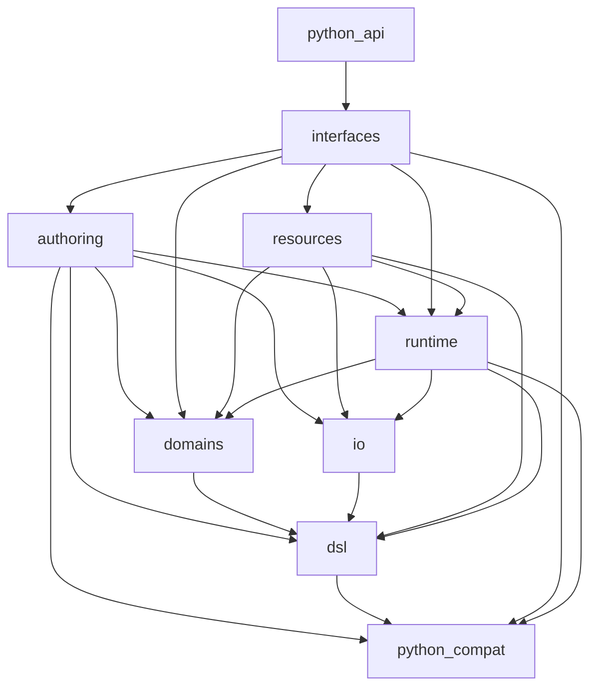
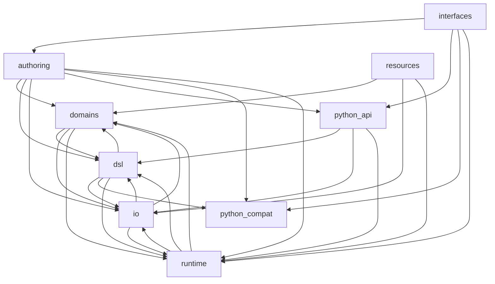

# Experiment 2 target architecture

The target is a smaller physical root, explicit component APIs, local types, and one canonical DSL
vocabulary. `architecture-contract.json` is the machine-checkable target. A baseline records only
the starting distance; success requires the baseline to become empty.

## Decisions

- `authoring` stays top-level because it is a first-class workflow with its own typed intent.
- `domains` stays top-level because published documentation imports its services and models.
- engine internals move below `engine/{dsl,runtime,io}`.
- CLI and MCP move below `interfaces`; `cli*.py` and `mcp/` disappear from the root.
- shipped demos move below `resources`.
- `datamimic.py`, `data_mimic_test.py`, and `factory/` stay as documented Python entry points but
  own no engine behavior.
- `_compat.py` stays because Python 3.10 is supported. It contains compatibility primitives only.
- there is no `services`, `utils`, `foundation`, or other miscellaneous target component.

## Target package root

```text
datamimic_ce/
├── authoring/
├── domains/
├── engine/
│   ├── dsl/
│   ├── runtime/
│   └── io/
├── interfaces/
├── resources/
├── factory/              # documented Python compatibility entry point
├── datamimic.py          # documented Python compatibility entry point
├── data_mimic_test.py    # documented test helper entry point
├── _compat.py            # Python 3.10 compatibility only
├── __init__.py
└── py.typed
```

## Target dependencies

<!-- archkeel-target-graph -->


## Observed dependencies

<!-- archkeel-component-graph -->


## Enforced properties

- every Python module has exactly one owner;
- every component edge is explicit and the graph is acyclic;
- cross-component imports use `api.py` or `contracts.py`;
- public boundary signatures use declared, component-owned types;
- `Any`, reflective dispatch, and string-literal dispatch are forbidden everywhere;
- dynamic execution is allowed only in the two explicit runtime owners;
- the root allow-list is exact.

## Evidence at freeze

- **FACT:** `development` has 22 root packages and 8 root Python modules.
- **FACT:** `services/` contains one 53-line source-template evaluator; it is not a service layer.
- **FACT:** the repository documentation imports `datamimic_ce.domains.*`; moving that API would be
  a compatibility break.
- **FACT:** Authoring already derives element schema and capabilities from engine registries, but
  its execution path imports runtime internals directly.
- **HYPOTHESIS:** physical ownership plus typed APIs will make the code easier to navigate and
  safer to change. The experiment measures structure and behavior, not subjective readability.
- **UNKNOWN:** the complete serial external-service result until the existing local services have
  been inspected and the suite has run.

`boundary_types` becomes executable per API when its first real function exists. ArchKeel 0.6.0
reports an unbuilt target API as `UNKNOWN`, which cannot be baselined; the protocol forbids dummy
functions and makes activation part of the API's first implementation commit.
