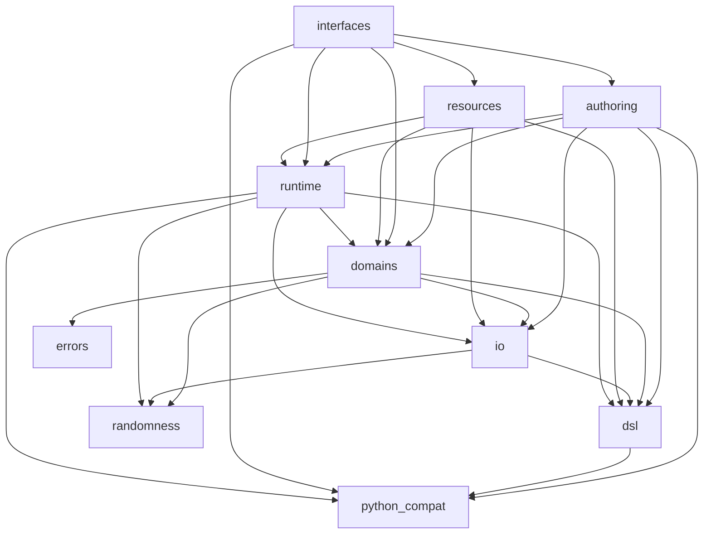
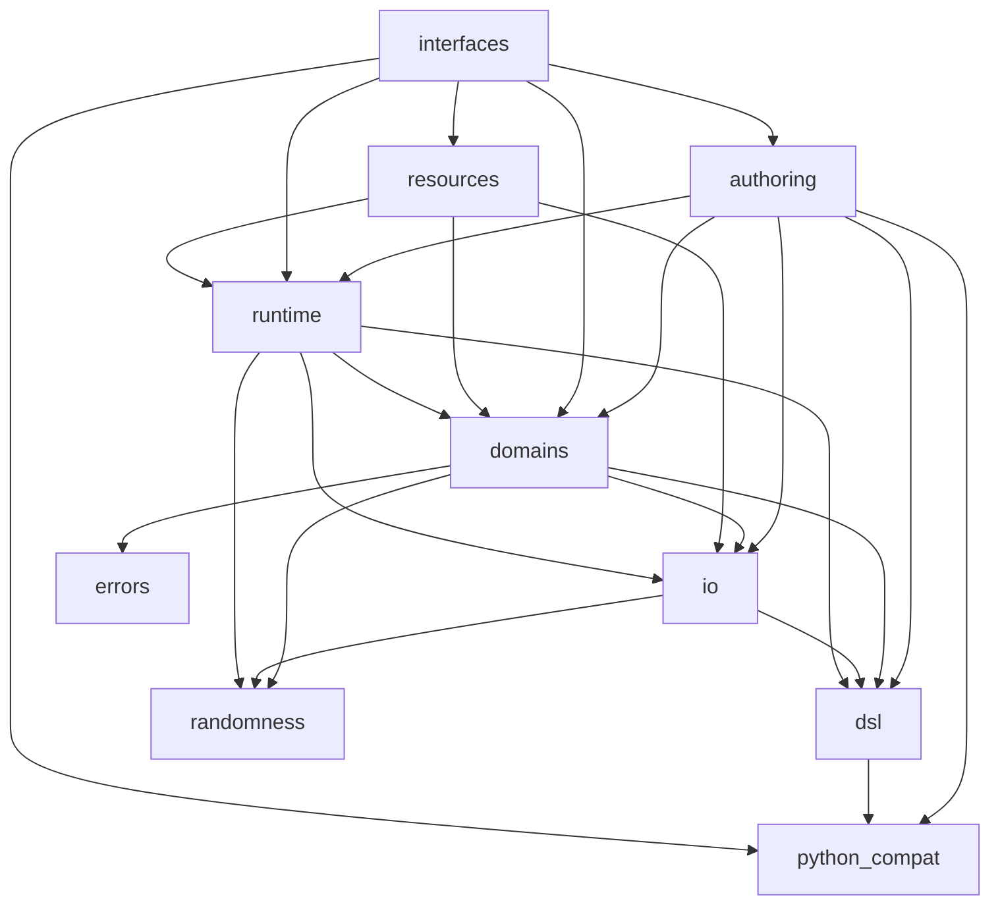

# Experiment 2 target architecture

The target is a smaller physical root, explicit component APIs, local types, and one canonical DSL
vocabulary. `architecture-contract.json` is the machine-checkable structural target. The
violation baseline records the starting distance; structural success requires its violation
list to become empty. Numeric budgets remain separate, non-increasing quality ratchets
(Amendment 12).

## Decisions

- `authoring` stays top-level because it is a first-class workflow with its own typed intent.
- `domains` stays top-level because published documentation imports its services and models.
- engine internals move below `engine/{dsl,runtime,io}`.
- CLI and MCP live in separate `interfaces/cli/` and `interfaces/mcp/` packages;
  CLI command modules do not sprawl across `interfaces/`.
- shipped demos move below `resources`.
- Python entry points live in `interfaces/python/{datamimic.py,data_mimic_test.py,factory.py}`
  and own no engine behavior. Old Python import paths have no compatibility shims
  ([Amendment 20](amendment-20.md)); descriptor compatibility is a separate behavior gate.
- `randomness.py` owns the shared RNG protocol and weighted-index primitive.
- `_compat.py` stays because Python 3.10 is supported. It contains compatibility primitives only.
- there is no `services`, `utils`, `foundation`, or other miscellaneous target component.
- `domains` reads packaged datasets only through `engine.io.dataset_api`; database IO remains
  forbidden there.

## Target package root

```text
datamimic_ce/
├── authoring/
├── domains/
├── engine/
│   ├── dsl/
│   ├── runtime/
│   └── io/
├── errors/
├── interfaces/
│   ├── cli/
│   ├── mcp/
│   ├── python/
│   │   ├── datamimic.py
│   │   ├── data_mimic_test.py
│   │   └── factory.py
│   ├── demo.py
│   └── project.py
├── randomness.py
├── resources/
├── _compat.py            # Python-version primitives
├── __init__.py           # inert installed-distribution origin anchor
└── py.typed
```

Engine and Interfaces are implicit grouping namespaces; their child APIs and active
initializers retain their own owners. The regular root initializer belongs only to
the exact-module `distribution` component, with no descendant scope, public API or
dependencies. Namespace discovery, other Python versions and EE packaging remain
unproven ([Amendment 169](amendment-169-interfaces-namespace.md),
[171](amendment-171-engine-namespace.md),
[173](amendment-173-root-distribution-owner.md)).

## Target dependencies

<!-- archkeel-target-graph -->

```mermaid
graph TD
    authoring --> domains
    authoring --> dsl
    authoring --> io
    authoring --> python_compat
    authoring --> runtime
    domains --> dsl
    domains --> errors
    domains --> io
    domains --> randomness
    dsl --> python_compat
    interfaces --> authoring
    interfaces --> domains
    interfaces --> python_compat
    interfaces --> resources
    interfaces --> runtime
    io --> dsl
    io --> randomness
    resources --> domains
    resources --> dsl
    resources --> io
    resources --> runtime
    runtime --> domains
    runtime --> dsl
    runtime --> io
    runtime --> randomness
    runtime --> python_compat
```

## Observed dependencies

<!-- archkeel-component-graph -->

```mermaid
graph TD
    authoring --> domains
    authoring --> dsl
    authoring --> io
    authoring --> python_compat
    authoring --> runtime
    domains --> dsl
    domains --> errors
    domains --> io
    domains --> randomness
    dsl --> python_compat
    interfaces --> authoring
    interfaces --> domains
    interfaces --> python_compat
    interfaces --> resources
    interfaces --> runtime
    io --> dsl
    io --> randomness
    resources --> domains
    resources --> io
    resources --> runtime
    runtime --> domains
    runtime --> dsl
    runtime --> io
    runtime --> randomness
```

## Memstore ownership correction

[Amendment 168](amendment-168-memstore-data-owner.md) separates mutable stored rows
from exporter dispatch: `engine.io.memstore` owns raw storage, aggregation and
its existing injected-client reconciliation; Runtime retains store lifecycle.
The shared nominal Exporter marker belongs to IO contracts. Generic source
loading/selection stays in IO data_sources; exporters retain their source-read
prohibition. Eight cohesive IO owners and seven exporter children need no
additional hierarchy. Old defining modules are removed without shims.

## Completion evidence

Physical layout, semantic target, observed conformance, report UX, and behavior are separate
acceptance claims. The current inventory has 148 `root_layout` scopes, 25 contracts, 24 mounts
and 151 components. All component decisions remain agent-authored; these counts establish
physical coverage, not semantic acceptance. An atomic semantic leaf is a
declared target node for an independently meaningful policy, behavior, API, or cross-component
boundary—not every filesystem directory. Its decision must be explicit in the containing
machine-checked architecture contract: ownership, an allowed dependency set (possibly empty), and a
public decision (a named API or deliberate `public: []`). Grouping-only folders inherit the nearest
parent contract; do not create one contract per directory. Aggregate cards such as
`runtime.contexts`, `tasks.flow`, or `tasks.values` cannot replace decisions for independently
meaningful children.

The final report must independently explore `Actual` (observed implementation), `Target` (declared
contracts and layout only), and `Diff` (their comparison), down to deliberate atomic leaves. `Target`
must not be derived by filtering observed edges. A structural or report pass does not prove behavior
preservation; behavior retains the separate protocol gates. An HTML view limited to Diagram,
Structure, and Review does not meet this report requirement.

## Enforced properties

- every Python module has exactly one owner;
- every component edge is explicit and the graph is acyclic;
- cross-component imports use the APIs explicitly declared by their owners;
- public boundary signatures use declared, component-owned types;
- explicit `Any`, casts, type ignores, and unapproved reflection are forbidden; four named
  DSL/runtime `__getattr__` adapters are exact exceptions;
- closed-vocabulary routing uses enums, verified by focused tests because the original ArchKeel 0.6.0 could not
  distinguish dispatch from ordinary string-value comparisons;
- dynamic execution is allowed only in the two explicit runtime owners;
- the root allow-list is exact.
- `interfaces/` has its own immediate-child allow-list, keeping CLI commands in one package.

The construct rules do not prove that every internal annotation is complete: remaining typing
signals and analyzer limits stay visible as quality measurements (Amendment 12).

[Amendment 95](amendment-95.md) permits native Python scripting-state and copy
memo only at reviewed exact Runtime positions. Fixed controls still require
declared types; these permissions do not waive properties, generator-cache or
other type debt. This is an explicit target correction, not a code improvement.

## Evidence at freeze

- **FACT:** `development` has 22 root packages and 8 root Python modules.
- **FACT:** `services/` contains one 53-line source-template evaluator; it is not a service layer.
- **FACT:** the repository documentation imports `datamimic_ce.domains.*`; moving that API would be
  a compatibility break.
- **FACT:** Authoring already derives element schema and capabilities from engine registries, but
  its execution path imports runtime internals directly.
- **HYPOTHESIS:** physical ownership plus typed APIs will make the code easier to navigate and
  safer to change. The experiment measures structure and behavior, not subjective readability.
- **UNKNOWN:** the complete serial external-service result until the existing local services have
  been inspected and the suite has run.

`boundary_types` becomes executable per API when its first real function exists. ArchKeel 0.6.0
reports an unbuilt target API as `UNKNOWN`, which cannot be baselined; the protocol forbids dummy
functions and makes activation part of the API's first implementation commit.
